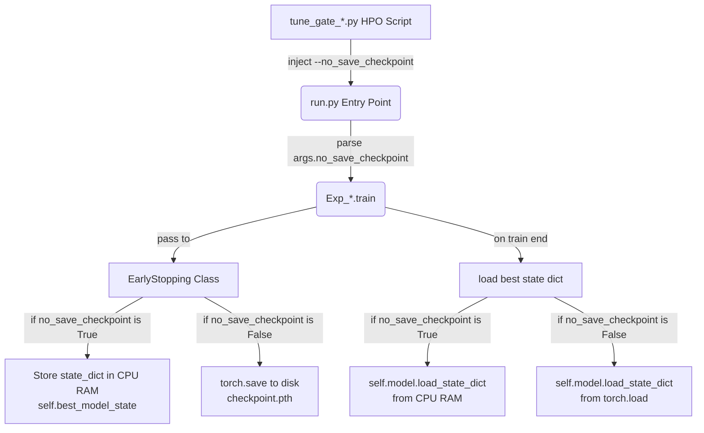

# Design Spec: Memory-Cached Early Stopping for Zero-Disk HPO Tuning

This specification details the design for introducing a `--no_save_checkpoint` flag to enable memory-based model checkpoint caching during hyperparameter optimization (HPO) trials. This prevents massive write cycles (TBW wear) on solid-state drives (SSDs) and bypasses Windows file explorer hanging issues during large-scale tuning runs.

## 1. Problem Statement
During Optuna HPO runs, dozens of trials are executed. In each trial, [EarlyStopping](file:///c:/Users/19331/Desktop/Code/agent/Gemini/demo-PureGS+Patchlinear/utils/tools.py#L81) routinely saves model weights (`checkpoint.pth` ~ dozens to hundreds of MBs) to disk whenever the validation loss decreases.
1. **SSD Wear**: A single tuning run can write hundreds of gigabytes (GB) to the SSD, degrading its lifespan (TBW limits).
2. **Windows File Deletion Lag**: Deleting thousands of deep learning model files using Windows Explorer is slow and routinely hangs at 99%.
3. **Execution Delay**: Disk write I/O stalls training iteration speed.

---

## 2. Proposed Changes

We will introduce a `--no_save_checkpoint` flag. When enabled, checkpoints are stored in CPU RAM and reloaded in-memory, skipping disk write operations. When disabled, the existing disk checkpoint behavior is retained.



### Affected Components & Details

#### ① Commandline Interface: `run.py`
- **File**: [run.py](file:///c:/Users/19331/Desktop/Code/agent/Gemini/demo-PureGS+Patchlinear/run.py)
- **Change**: Add a new argument `--no_save_checkpoint` (type `store_true`, defaults to `False`).
```python
parser.add_argument("--no_save_checkpoint", action="store_true", default=False, 
                    help="Cache best model in CPU memory instead of writing to disk during training.")
```

#### ② Early Stopping Utility: `utils/tools.py`
- **File**: [tools.py](file:///c:/Users/19331/Desktop/Code/agent/Gemini/demo-PureGS+Patchlinear/utils/tools.py)
- **Change**: Add `no_save_checkpoint=False` to `EarlyStopping.__init__` and store it as an instance attribute. Add `self.best_model_state = None`.
- **Change**: Modify `EarlyStopping.save_checkpoint`. If `no_save_checkpoint` is enabled, deep-copy the state dictionary and move all tensor variables to CPU to conserve GPU VRAM:
```python
def save_checkpoint(self, val_loss, model, path):
    if self.verbose:
        print(f'Validation loss decreased ({self.val_loss_min:.6f} --> {val_loss:.6f}).  Saving model ...')
    
    if self.no_save_checkpoint:
        import copy
        self.best_model_state = {k: v.cpu().clone() for k, v in model.state_dict().items()}
    else:
        if not os.path.exists(path):
            os.makedirs(path)
        torch.save(model.state_dict(), path + '/' + 'checkpoint.pth')
        
    self.val_loss_min = val_loss
```

#### ③ Experiment Controllers: `exp/exp_long_term_forecasting.py` and `exp/exp_short_term_forecasting.py`
- **Files**:
  - [exp_long_term_forecasting.py](file:///c:/Users/19331/Desktop/Code/agent/Gemini/demo-PureGS+Patchlinear/exp/exp_long_term_forecasting.py)
  - [exp_short_term_forecasting.py](file:///c:/Users/19331/Desktop/Code/agent/Gemini/demo-PureGS+Patchlinear/exp/exp_short_term_forecasting.py)
- **Change**:
  - In `train` method, construct `EarlyStopping` passing `no_save_checkpoint=self.args.no_save_checkpoint`.
  - Avoid creating checkpoint directories when `--no_save_checkpoint` is specified:
    ```python
    path = os.path.join(self.args.checkpoints, setting)
    if not self.args.no_save_checkpoint:
        if not os.path.exists(path):
            os.makedirs(path)
    ```
  - In `train` method termination block, load weights from RAM if `--no_save_checkpoint` is enabled:
    ```python
    if self.args.no_save_checkpoint:
        if early_stopping.best_model_state is not None:
            self.model.load_state_dict(early_stopping.best_model_state)
        else:
            print("Warning: No best model state found in memory.")
    else:
        best_model_path = path + '/' + 'checkpoint.pth'
        self.model.load_state_dict(torch.load(best_model_path))
    ```

#### ④ Hyperparameter Tuning Scripts: `tune_gate_*.py`
- **Files**:
  - [tune_gate_etth1.py](file:///c:/Users/19331/Desktop/Code/agent/Gemini/demo-PureGS+Patchlinear/tune_gate_etth1.py)
  - [tune_gate_etth2.py](file:///c:/Users/19331/Desktop/Code/agent/Gemini/demo-PureGS+Patchlinear/tune_gate_etth2.py)
  - [tune_gate_ettm1.py](file:///c:/Users/19331/Desktop/Code/agent/Gemini/demo-PureGS+Patchlinear/tune_gate_ettm1.py)
  - [tune_gate_ettm2.py](file:///c:/Users/19331/Desktop/Code/agent/Gemini/demo-PureGS+Patchlinear/tune_gate_ettm2.py)
- **Change**: In `build_command`, append `"--no_save_checkpoint"` to the command list:
```python
cmd.extend(["--no_save_checkpoint"])
```

---

## 3. Verification Plan

### Automated Verification
A unit test script will be written under `tests/test_no_save_checkpoint.py` to:
1. Run a 1-epoch training loop with `--no_save_checkpoint` set.
2. Confirm training and evaluation complete successfully.
3. Assert that no checkpoint directory/file is generated on disk.
4. Assert that training finishes using the best epoch's weights.

### Manual Verification
1. Run a normal training trial via `run.py` without `--no_save_checkpoint` to verify standard weights are successfully written to disk.
2. Run `tune_gate_etth1.py` for 2 trials to check that Optuna operates smoothly without dumping checkpoints.
